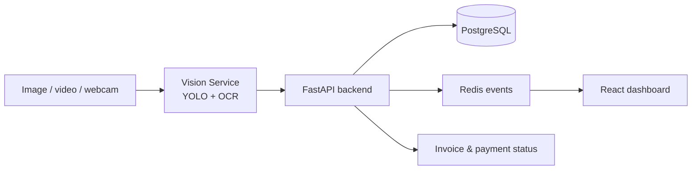

# SmartPark AI

> Intelligent parking management with computer vision, real-time availability, role-based access, automated billing and customer self-service.


## Overview

SmartPark AI is a PFE-ready parking platform. Staff use image, recorded-video or webcam capture to simulate a camera feed. The Vision Service identifies a vehicle and its plate, then the backend manages entry, exit, spot status, invoices and alerts in real time.



## Features

- Vehicle detection and plate OCR from images, recorded videos and captured webcam frames.
- Automatic entry: create a parking session and mark the spot as `OCCUPIED`.
- Automatic exit: close the session, calculate the fee, create a `PENDING` invoice and free the spot.
- Real-time dashboard updates through WebSocket and Redis.
- Parking spots, sessions, reservations, alerts, payments and analytics.
- Customer onboarding with full name, CIN and vehicle plate; plates are linked to the customer account.
- Separate Customer and Staff portals with role-based permissions.
- Blacklisted-vehicle and reservation-time-exceeded alerts.
- Periodic reservation overtime monitoring and live alert events.
- Login rate limiting, password-reset workflow and Docker health checks.

## Roles

| Role | Main access |
| --- | --- |
| `SUPER_ADMIN` | Full platform administration, users, settings and reporting |
| `ADMIN` | Operations, users, parking management, payments and analytics |
| `OPERATOR` | Entry/exit, sessions, vehicles, spots, payments and alerts |
| `SECURITY` | Camera detection, vehicle lookup, spots, sessions and alerts |
| `USER` | Smart Parking, personal parking history, reservations and payments |

## Demo scenario

1. A customer creates an account and registers a plate.
2. A staff member selects **Entry** in Camera Detection, uploads a short video or captures a webcam frame, then selects a free spot.
3. The plate is detected, the parking session is created and the spot becomes `OCCUPIED`.
4. The customer sees the active visit in **My Parking**.
5. Staff selects **Exit** and processes the same vehicle.
6. The spot becomes `FREE`; an invoice appears in the customer **Payments** screen.
7. The customer completes the simulated payment with **Pay now**.
8. Staff can show blacklist and reservation overtime alerts in **Alerts**.

For a camera-free PFE presentation, use a 5–15 second MP4/WebM/MOV where the plate is visible for at least one second. The Vision Service samples video frames automatically.

## Architecture

```text
frontend/           React + Vite user and staff portal
backend/            FastAPI, SQLAlchemy, PostgreSQL, Redis/WebSocket
vision-service/     FastAPI, YOLO, EasyOCR, OpenCV
docker-compose.yml  Local multi-service deployment
```

## Quick start with Docker

### Prerequisites

- Docker Desktop
- Git

### Run

```powershell
git clone https://github.com/balsem2/smart-parking-management-system.git
cd smart-parking-management-system
Copy-Item .env.example .env
```

Open `.env` and replace `JWT_SECRET_KEY` and `POSTGRES_PASSWORD` with strong local values, then run:

```powershell
docker compose up --build
```

| Service | URL |
| --- | --- |
| Frontend | http://localhost:5173 |
| Backend API | http://localhost:8001 |
| Backend docs | http://localhost:8001/docs |
| Vision Service | http://localhost:8002 |

The first Vision inference may take longer because YOLO and EasyOCR assets are downloaded when needed.

## Local development

### Backend

```powershell
cd backend
..\.venv\Scripts\python.exe -m pip install -r requirements-dev.txt
..\.venv\Scripts\python.exe -m uvicorn app.main:app --reload --port 8001
```

### Frontend

```powershell
cd frontend
npm install
npm run dev
```

### Vision Service

```powershell
cd vision-service
..\.venv\Scripts\python.exe -m pip install -r requirements.txt
..\.venv\Scripts\python.exe -m uvicorn app:app --reload --port 8002
```

## Configuration

All secrets stay in `.env`, which is ignored by Git. Start from `.env.example`.

| Variable | Purpose |
| --- | --- |
| `DATABASE_URL` | Backend database connection for local development |
| `REDIS_URL` | Redis event bus connection |
| `JWT_SECRET_KEY` | Secret used to sign access tokens |
| `RESERVATION_MONITOR_INTERVAL_SECONDS` | Overtime-alert polling interval, minimum 15 seconds |
| `LOGIN_RATE_LIMIT_MAX_ATTEMPTS` | Failed login attempts allowed per client/email |
| `LOGIN_RATE_LIMIT_WINDOW_SECONDS` | Login-rate-limit window in seconds |

## Testing and CI

Run backend tests locally:

```powershell
cd backend
..\.venv\Scripts\python.exe -m pytest tests -q
```

GitHub Actions runs automatically on each push and pull request:

- Backend tests
- Frontend production build
- Vision Service syntax check

## Useful demo data

Create the two alert examples used in a presentation:

```powershell
cd backend
..\.venv\Scripts\python.exe create_demo_alerts.py
```

The script is idempotent and creates no duplicate active alerts.

## Current scope and production handoff

SmartPark AI provides a complete simulated parking flow for a PFE demonstration. The following require external resources before a production rollout:

- **Real payment gateway:** a Flouci, Stripe or other provider account, API keys and webhook configuration.
- **Live IP camera/barrier:** camera stream URL, supported hardware and barrier-controller protocol.
- **Dedicated Tunisian plate model:** labelled dataset, training environment and accuracy evaluation.
- **Production operations:** HTTPS domain, backups, external rate limiter, monitoring and alerting.
